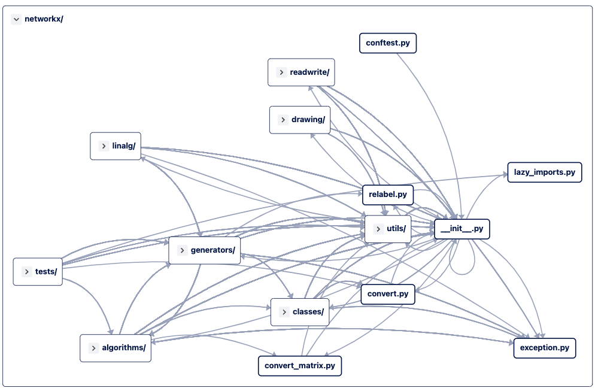
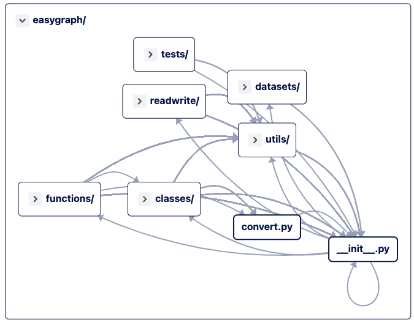
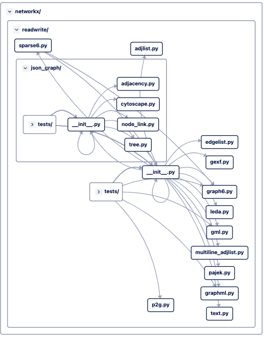
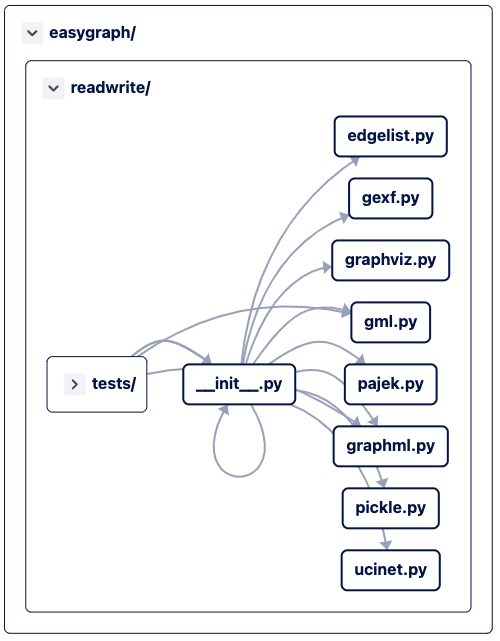

# A Rough Comparison of the two Python Graph Libraries NetworkX and EasyGraph

**A work in progress**

[NetworkX](https://networkx.org)

[EasyGraph](https://github.com/easy-graph/Easy-Graph)

EasyGraph mentioned in this article refers to v0.2a38, unless specified otherwise.

- [A Rough Comparison of the two Python Graph Libraries NetworkX and EasyGraph](#a-rough-comparison-of-the-two-python-graph-libraries-networkx-and-easygraph)
  - [Overview](#overview)
  - [Classes and Functions](#classes-and-functions)
  - [Dependencies](#dependencies)
  - [Graph classes](#graph-classes)
    - [NetworkX](#networkx)
    - [EasyGraph](#easygraph)
  - [Graph Algorithms](#graph-algorithms)
  - [Graph I/O](#graph-io)

## Overview

NetworkX has [a LOT more](#classes-and-functions) [features](#graph-algorithms) EasyGraph, but lacks SHS detection features. It's first commit was in 2005.

It has lots of contributors and is still being actively developed, and is [used by a lot of people](https://github.com/networkx/networkx/network/dependents) (107,831 Repositories, 4,003 Packages).

[NetworkX GitHub Pulse](https://github.com/networkx/networkx/pulse)

EasyGraph is developed by Fudan University students, and its development and code base is quite messy and not governed by a written rule. The first commit was in 2020.

EasyGraph GitHub Pulse [(last week)](https://github.com/easy-graph/Easy-Graph/pulse), [(last month)](https://github.com/easy-graph/Easy-Graph/pulse/monthly), and the only project that depends on EasyGraph is my [easygraph-test](https://github.com/easy-graph/Easy-Graph/network/dependents) repository.


The [documentation](https://easy-graph.github.io/) sucks, the [tutorial code](https://easy-graph.github.io/tutorial.html) doesn't work as advertised (cuz it's outdated), and the API reference only contains [class and function signatures](https://easy-graph.github.io/reference/structural_hole_spanners.html).  
It's likely you'd find the source code to be more useful than the documentation.

EG devs say they have better support for reading from and writing to a wide range of graph formats, but that's not true. NetworkX still wins in that respect.





## Classes and Functions

See [Symbol Comparison](./symbol-comparison.md)

## Dependencies

[NetworkX Dependency Graph](https://github.com/networkx/networkx/network/dependencies)

[EasyGraph Dependency Graph](https://github.com/easy-graph/Easy-Graph/network/dependencies)

NetworkX, surprisingly, has no dependencies, only some optional dependencies, specified in its `requirements` directory.

Example: the `[default]` optional dependency group includes libraries like `matplotlib` for drawing.

The core functionalities of NetworkX (graph representation, graph algorithms) does not depend on any other libraries.

<!-- cSpell:disable -->
EasyGraph, on the other hand, specified a bunch of utility dependencies (`joblib`, `progressbar`, `tqdm`) heavy dependencies (`numpy`, `pandas`, `matplotlib`, `scikit-learn`, `tensorflow`) as required.

Its core classes don't require these dependencies.

`numpy` is heavily used in many of EasyGraph's code base, for various purposes:
- Graph representation (`graphml.py`, `ucinet.py`, `gexf.py`)
- Utility code (`alias.py`, `to_numpy_matrix`, `to_numpy_array`)
- Almost all files that implement some SHS detection algorithms (`maxBlock.py` and many others)

ML libs `sklearn` and `tensorflow` are used only for implementing SHS detection algorithms.

The utility functions aren't really necessary and could be moved to optional deps.


<!-- cSpell:enable -->

## Graph classes


Both libraries have classes for `undirected` and `directed` graphs and multigraphs (parallel edges allowed).

### NetworkX

NetworkX also supports [Ordered Graphs](https://networkx.org/documentation/stable/reference/classes/ordered.html) which give a consistent order for reporting of nodes and edges, but it's being deprecated.

NetworkX graphs' `edges` attribute (or should I say, property) returns data of type `EdgeView`,

the library also has `DegreeView, EdgeView, NodeView, AdjacencyView` view classes and `FilterAdjacency, FilterMultiInner, FilterMultiAdjacency` filter classes defined.

The view classes are quiet sophisticated and define dunder methods like `__len__`, `__iter__` and `__contains__`, and provide Pythonic interface for the users.

`classes/filters.py` defines `[ "no_filter", "hide_nodes", "hide_edges", "hide_multiedges", "hide_diedges", "hide_multidiedges", "show_nodes", "show_edges", "show_multiedges", "show_diedges", "show_multidiedges"]`, which provides toggles for graph instances so that users can choose what kinds of nodes / edges to receive.

`classes/function.py` defines common functions (`neighbors`, `density`, `is_directed`, `to_directed` etc) that operate on the view classes mentioned above.

### EasyGraph

The undirected graph class `Graph` has a C++ counter part `GraphC`, which is still quite [buggy](https://github.com/tddschn/easygraph-test).

The `operations.py`, like `function.py` in NetworkX, implements a small number of common graph operations.

There's no view or filter classes, just the four graph classes. 

The `edges` property returns a list of edges.

Dunder methods are only defined directly on the graph classes. (NetworkX does this too)

## Graph Algorithms

<details>
  <summary>networkx/algorithms</summary>
  
  ```
networkx/algorithms
├── __init__.py
├── approximation
│  ├── __init__.py
│  ├── clique.py
│  ├── clustering_coefficient.py
│  ├── connectivity.py
│  ├── distance_measures.py
│  ├── dominating_set.py
│  ├── kcomponents.py
│  ├── matching.py
│  ├── maxcut.py
│  ├── ramsey.py
│  ├── steinertree.py
│  ├── traveling_salesman.py
│  ├── treewidth.py
│  └── vertex_cover.py
├── assortativity
│  ├── __init__.py
│  ├── connectivity.py
│  ├── correlation.py
│  ├── mixing.py
│  ├── neighbor_degree.py
│  └── pairs.py
├── asteroidal.py
├── bipartite
│  ├── __init__.py
│  ├── basic.py
│  ├── centrality.py
│  ├── cluster.py
│  ├── covering.py
│  ├── edgelist.py
│  ├── generators.py
│  ├── matching.py
│  ├── matrix.py
│  ├── projection.py
│  ├── redundancy.py
│  └── spectral.py
├── boundary.py
├── bridges.py
├── centrality
│  ├── __init__.py
│  ├── betweenness.py
│  ├── betweenness_subset.py
│  ├── closeness.py
│  ├── current_flow_betweenness.py
│  ├── current_flow_betweenness_subset.py
│  ├── current_flow_closeness.py
│  ├── degree_alg.py
│  ├── dispersion.py
│  ├── eigenvector.py
│  ├── flow_matrix.py
│  ├── group.py
│  ├── harmonic.py
│  ├── katz.py
│  ├── load.py
│  ├── percolation.py
│  ├── reaching.py
│  ├── second_order.py
│  ├── subgraph_alg.py
│  ├── trophic.py
│  └── voterank_alg.py
├── chains.py
├── chordal.py
├── clique.py
├── cluster.py
├── coloring
│  ├── __init__.py
│  ├── equitable_coloring.py
│  └── greedy_coloring.py
├── communicability_alg.py
├── community
│  ├── __init__.py
│  ├── asyn_fluid.py
│  ├── centrality.py
│  ├── community_utils.py
│  ├── kclique.py
│  ├── kernighan_lin.py
│  ├── label_propagation.py
│  ├── louvain.py
│  ├── lukes.py
│  ├── modularity_max.py
│  └── quality.py
├── components
│  ├── __init__.py
│  ├── attracting.py
│  ├── biconnected.py
│  ├── connected.py
│  ├── semiconnected.py
│  ├── strongly_connected.py
│  └── weakly_connected.py
├── connectivity
│  ├── __init__.py
│  ├── connectivity.py
│  ├── cuts.py
│  ├── disjoint_paths.py
│  ├── edge_augmentation.py
│  ├── edge_kcomponents.py
│  ├── kcomponents.py
│  ├── kcutsets.py
│  ├── stoerwagner.py
│  └── utils.py
├── core.py
├── covering.py
├── cuts.py
├── cycles.py
├── d_separation.py
├── dag.py
├── distance_measures.py
├── distance_regular.py
├── dominance.py
├── dominating.py
├── efficiency_measures.py
├── euler.py
├── flow
│  ├── __init__.py
│  ├── boykovkolmogorov.py
│  ├── capacityscaling.py
│  ├── dinitz_alg.py
│  ├── edmondskarp.py
│  ├── gomory_hu.py
│  ├── maxflow.py
│  ├── mincost.py
│  ├── networksimplex.py
│  ├── preflowpush.py
│  ├── shortestaugmentingpath.py
│  └── utils.py
├── graph_hashing.py
├── graphical.py
├── hierarchy.py
├── hybrid.py
├── isolate.py
├── isomorphism
│  ├── __init__.py
│  ├── ismags.py
│  ├── isomorph.py
│  ├── isomorphvf2.py
│  ├── matchhelpers.py
│  ├── temporalisomorphvf2.py
│  ├── tree_isomorphism.py
│  └── vf2userfunc.py
├── link_analysis
│  ├── __init__.py
│  ├── hits_alg.py
│  └── pagerank_alg.py
├── link_prediction.py
├── lowest_common_ancestors.py
├── matching.py
├── minors
│  ├── __init__.py
│  └── contraction.py
├── mis.py
├── moral.py
├── node_classification
│  ├── __init__.py
│  ├── hmn.py
│  ├── lgc.py
│  └── utils.py
├── non_randomness.py
├── operators
│  ├── __init__.py
│  ├── all.py
│  ├── binary.py
│  ├── product.py
│  └── unary.py
├── planar_drawing.py
├── planarity.py
├── polynomials.py
├── reciprocity.py
├── regular.py
├── richclub.py
├── shortest_paths
│  ├── __init__.py
│  ├── astar.py
│  ├── dense.py
│  ├── generic.py
│  ├── unweighted.py
│  └── weighted.py
├── similarity.py
├── simple_paths.py
├── smallworld.py
├── smetric.py
├── sparsifiers.py
├── structuralholes.py
├── summarization.py
├── swap.py
├── threshold.py
├── tournament.py
├── traversal
│  ├── __init__.py
│  ├── beamsearch.py
│  ├── breadth_first_search.py
│  ├── depth_first_search.py
│  ├── edgebfs.py
│  └── edgedfs.py
├── tree
│  ├── __init__.py
│  ├── branchings.py
│  ├── coding.py
│  ├── decomposition.py
│  ├── mst.py
│  ├── operations.py
│  └── recognition.py
├── triads.py
├── vitality.py
├── voronoi.py
└── wiener.py

  ```
<!-- Two important rules:

Make sure you have an empty line after the closing </summary> tag, otherwise the markdown/code blocks won't show correctly.
Make sure you have an empty line after the closing </details> tag if you have multiple collapsible sections. -->
</details>


<details>
  <summary>easygraph/functions</summary>
  
  ```
functions
├── __init__.py
├── centrality
│  ├── __init__.py
│  ├── betweenness.py
│  ├── clossness.py
│  ├── degree.py
│  └── flowbetweenness.py
├── community
│  ├── __init__.py
│  ├── LPA.py
│  ├── modularity.py
│  ├── modularity_max_detection.py
│  └── motif.py
├── components
│  ├── __init__.py
│  ├── biconnected.py
│  ├── connected.py
│  └── ego_betweenness.py
├── drawing
│  ├── __init__.py
│  ├── drawing.py
│  ├── plot.py
│  └── positioning.py
├── graph_embedding
│  ├── __init__.py
│  ├── deepwalk.py
│  ├── line.py
│  ├── NOBE.py
│  ├── node2vec.py
│  └── sdne.py
├── graph_generator
│  ├── __init__.py
│  ├── classic.py
│  └── RandomNetwork.py
├── not_sorted
│  ├── __init__.py
│  ├── bridges.py
│  ├── cluster.py
│  ├── laplacian.py
│  ├── mst.py
│  └── pagerank.py
├── path
│  ├── __init__.py
│  └── path.py
└── structural_holes
   ├── __init__.py
   ├── AP_Greedy.py
   ├── evaluation.py
   ├── HAM.py
   ├── HIS.py
   ├── ICC.py
   ├── maxBlock.py
   ├── MaxD.py
   ├── metrics.py
   ├── NOBE.py
   ├── SHII_metric.py
   ├── strong_connected_component.py
   └── weakTie.py

  ```
<!-- Two important rules:

Make sure you have an empty line after the closing </summary> tag, otherwise the markdown/code blocks won't show correctly.
Make sure you have an empty line after the closing </details> tag if you have multiple collapsible sections. -->
</details>

## Graph I/O




